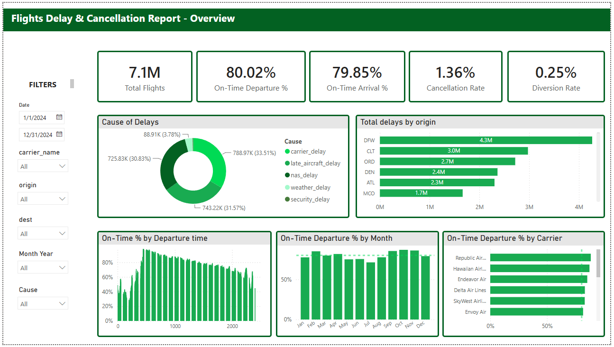
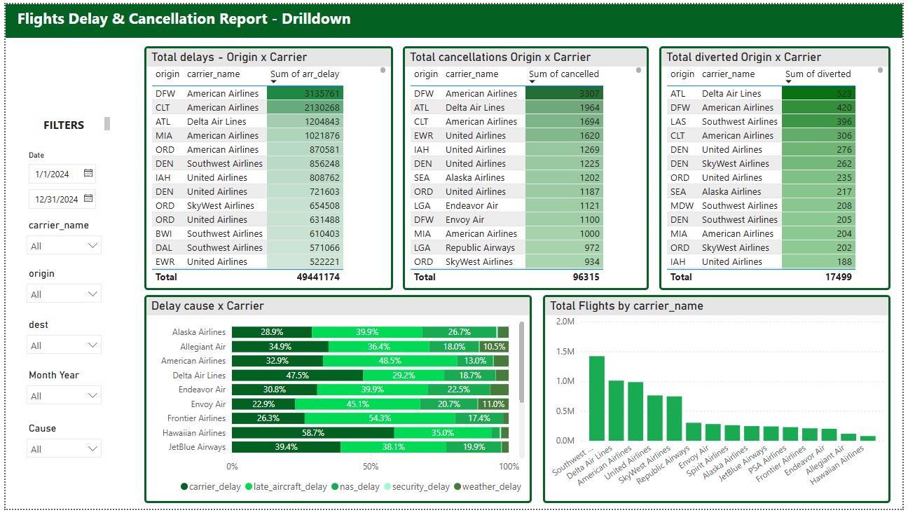
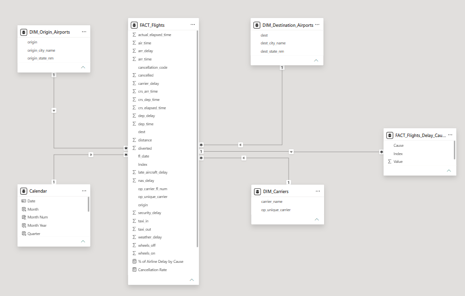

# flight-analysis
An executive-level Power BI dashboard analyzing U.S. domestic flight delays and cancellations, built to answer five core business questions around delay drivers, airline/airport performance, and operational priorities.

---

📁 Data Source
- **Source:** https://www.kaggle.com/datasets/hrishitpatil/flight-data-2024
- **Size:** 7+ Million rows

---

🧱 Data Model

Star schema built from a single flat source file, split into fact and dimension tables in Power Query. Relationships are all single-direction, one-to-many from each dimension into the fact tables.

# Tables:

**FACT_Flights** — one row per flight: fl_date, dep_delay, arr_delay, dep_time, arr_time, crs_dep_time, crs_arr_time, crs_elapsed_time, actual_elapsed_time, air_time, taxi_in, taxi_out, wheels_off, wheels_on, distance, cancelled, cancellation_code, diverted, plus the five raw delay-cause columns (carrier_delay, weather_delay, nas_delay, security_delay, late_aircraft_delay) and an Index key used to relate to the delay-cause fact table. Also holds two measures built directly on this table: % of Airline Delay by Cause and Cancellation Rate.

**FACT_Flights_Delay_Cause** — unpivoted bridge table: Cause, Index (FK back to FACT_Flights), Value (delay minutes). Built by unpivoting the five delay-cause columns above and filtering out zero-minute rows, so one Cause field drives every cause-breakdown visual instead of five separate measures.

**Calendar** — standalone date table (Date, Month, Month Num, Month Year, Quarter), marked as a Date Table for time-intelligence functions.

**DIM_Carriers** — op_unique_carrier mapped to carrier_name (full airline name).

**DIM_Origin_Airports** — origin, origin_city_name, origin_state_nm.

**DIM_Destination_Airports** — dest, dest_city_name, dest_state_nm.

---

🔍 Key Findings
- Network performance is stable but leaves room to improve with ~80% on time departure. Cancellation Rate (1.36%) and Diversion Rate (0.25%) are both low, so the core issue is delay, not disruption.
- Delay causes are almost evenly split three ways. There is no single dominant driver. Carrier-caused delay (33.51%), late aircraft delay (31.57%), and NAS/airport congestion delay (30.83%) are all within 3 points of each other.
- Delay is heavily concentrated at a small number of hub airports. DFW, CLT, ORD, etc.
- Time-of-day matters more than time-of-year. On-Time % by departure hour shows a sharp trough in early-morning hours before climbing and holding through midday, then declining again into the evening.
- Flight volume and delay burden are not proportional. Southwest Airlines operates the highest flight volume by a wide margin (~1.8–2M flights) yet does not appear among the worst on-time performers, while American Airlines — with materially fewer total flights than Southwest — drives the largest delay and cancellation totals at multiple hubs.

---

✅ Recommendations
1. Prioritize DFW and CLT operations, specifically American Airlines' turnaround process at both.
2. Address early-morning and evening departure windows
3. Treat carrier-caused and late-aircraft delay as the priority levers, not weather.